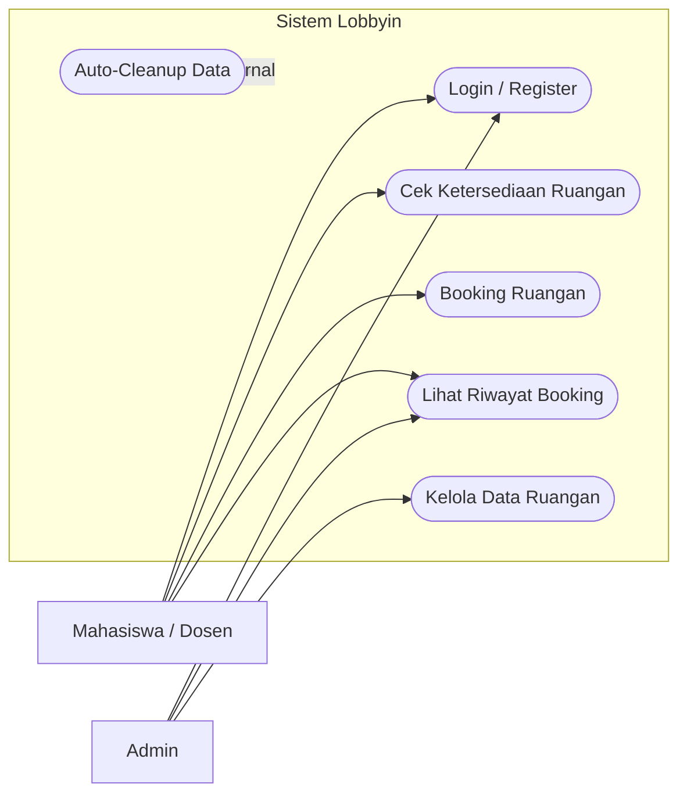
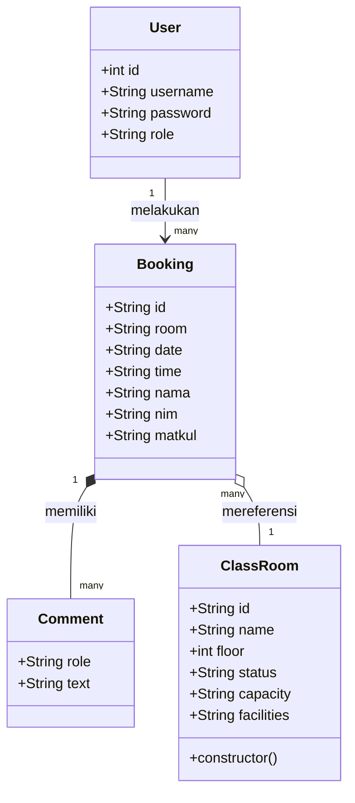

# Diagram UML - Lobbyin

Dokumen ini berisi representasi visual dari arsitektur dan fungsionalitas aplikasi Lobbyin.

## 1. Use Case Diagram
Diagram ini menunjukkan interaksi antara pengguna (Mahasiswa, Dosen, Admin) dan fungsi-fungsi utama dalam sistem.

## 2. Class Diagram
Diagram ini menunjukkan struktur data dan kelas utama yang digunakan dalam pengembangan aplikasi.

